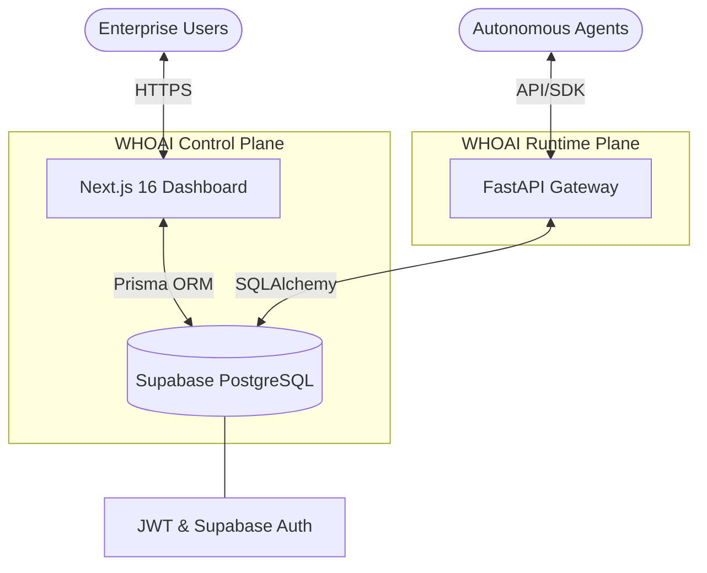

<div align="center">
  
  # WHOAI Platform

  [](https://nextjs.org/)
  [](https://www.typescriptlang.org/)
  [](https://fastapi.tiangolo.com/)
  [](https://www.prisma.io/)
  [](https://www.postgresql.org/)
  [](https://supabase.com/)
  [](https://vercel.com/)

  > **WHOAI helps enterprises see, control, and reduce AI spending before runaway agents become runaway costs.**

  We identify wasted spend, runaway agents, duplicate prompts, and optimization opportunities. If we don't find meaningful savings, don't buy. WHOAI is the enterprise API Gateway and operational control plane that tracks every dollar your autonomous agents spend and eliminates shadow AI.

</div>

## Features

- 💸 **Reduce AI Spend 15-30%:** Real-time observability into token spend. Find exactly which team owns the spend.
- 🛑 **Cost Anomaly Detection:** Get alerts when an agent's spend increases by 400% in 45 minutes.
- 🔌 **Kill Switch:** Instantly suspend runaway agents before they burn through your API budget.
- 📊 **Executive Dashboard:** Visualize daily and monthly token burn rates, active agents, and top cost offenders.
- 📈 **Analytics & Insights:** Real-time data visualization of agent spending trends and model distribution.
- 🔀 **High-Performance AI Gateway:** Scalable ingestion layer that intercepts LLM traffic, meters API usage, and enforces budgets. Available for VPC self-hosting.
- 🏢 **Enterprise Multi-Tenancy:** Secure data isolation via strict Organization-level constraints and Role-Based Access Control (RBAC).

## Architecture

WHOAI operates on a split-plane architecture: a Next.js Management/Control Plane for human operators, and a FastAPI Runtime/Ingestion Plane for high-throughput AI agent traffic. Both planes share a unified PostgreSQL database via Prisma ORM.



## Tech Stack

| Component | Technology | Purpose |
| :--- | :--- | :--- |
| **Frontend Framework** | Next.js 16 (App Router) | React server components, static generation, and dashboard UI. |
| **Backend (Mgmt)** | Next.js API Routes | Dashboard API endpoints and server actions. |
| **Backend (Gateway)** | FastAPI (Python 3) | High-throughput AI telemetry ingestion and evaluation. |
| **Language** | TypeScript / Python | Strict end-to-end type safety across both stacks. |
| **Database** | PostgreSQL (Supabase) | Scalable relational data storage. |
| **ORM** | Prisma | Schema definitions, migrations, and typed database client. |
| **Styling** | Tailwind CSS v4 | Utility-first responsive design. |
| **Charting** | Recharts | Interactive SVG charts for the Analytics dashboard. |
| **Authentication** | JWT + Supabase SSR | Secure, stateless HTTP-only cookie authentication. |
| **Deployment** | Vercel / Render | Serverless edge deployment. |

## Project Structure

```text
whoai-platform/
├── app/                      # Next.js App Router (Frontend & API)
│   ├── analytics/            # FinOps Insights & KPI Dashboard
│   ├── api/                  # Next.js API Routes (Mgmt Plane)
│   ├── agents/               # Agent Registry & Budget Management
│   └── layout.tsx & page.tsx # Core Landing Page & Layout
├── components/               # Reusable React UI Components
├── database/                 # FastAPI SQLAlchemy Models & Session
├── lib/                      # Next.js Utilities (Prisma Client, Auth, Actions)
├── prisma/                   # Database Schema & Migrations
│   └── schema.prisma         # Single Source of Truth for Data Models
├── routers/                  # FastAPI Route Handlers (Runtime Plane)
├── utils/                    # Supabase SSR Utilities
├── main.py                   # FastAPI Application Entrypoint
├── package.json              # Node.js Dependencies & Scripts
└── requirements.txt          # Python Dependencies
```

## Getting Started

### Prerequisites

- Node.js (v18+)
- Python (v3.10+)
- PostgreSQL database (Supabase recommended)

### Installation

1. **Clone the repository:**
   ```bash
   git clone https://github.com/your-org/whoai-platform.git
   cd whoai-platform
   ```

2. **Install Node.js dependencies:**
   ```bash
   npm install
   ```

3. **Set up Python Virtual Environment:**
   ```bash
   python3 -m venv .venv
   source .venv/bin/activate
   pip install -r requirements.txt
   ```

### Environment Variables

Create a `.env` file in the root directory:

```env
# Database Connections
DATABASE_URL="postgresql://postgres:[PASSWORD]@[HOST]:6543/postgres?pgbouncer=true"
DIRECT_URL="postgresql://postgres:[PASSWORD]@[HOST]:5432/postgres"

# Authentication
NEXTAUTH_SECRET="your_super_secret_jwt_key_here"

# Supabase Configurations
NEXT_PUBLIC_SUPABASE_URL="https://[YOUR_SUPABASE_REF].supabase.co"
NEXT_PUBLIC_SUPABASE_ANON_KEY="your_supabase_anon_key"
```

### Database Setup

Sync the Prisma schema to your PostgreSQL database:

```bash
npx prisma generate
npx prisma db push
```

### Running Locally

The project uses `concurrently` to run both the Next.js frontend and the FastAPI backend simultaneously:

```bash
npm run dev
```

- **Dashboard (Next.js):** `http://localhost:3000`
- **API Gateway (FastAPI):** `http://localhost:8001/docs`

### Building for Production

```bash
npm run build
```

### Deployment

**Vercel (Next.js Frontend & Mgmt API):**
1. Connect your repository to Vercel.
2. Set the Build Command to `prisma generate && next build`.
3. Add all `.env` variables to the Vercel project settings.
4. Deploy.

## API Overview

### Next.js Management API
| Endpoint | Method | Purpose |
| :--- | :--- | :--- |
| `/api/ai-workers/auth/signup` | `POST` | Registers a new Organization and Owner. |
| `/api/ai-workers/auth/login` | `POST` | Authenticates a user and sets a secure JWT cookie. |
| `/api/auth/me` | `GET` | Validates session and retrieves user details. |
| `/api/agents` | `GET`, `POST` | Manages active AI agents and budget thresholds. |
| `/api/spend` | `GET` | Fetches token burn and cost metrics across the workspace. |
| `/api/alerts` | `GET`, `POST` | Manages spend anomaly alerts and risk thresholds. |

### FastAPI Runtime Gateway
| Endpoint | Method | Purpose |
| :--- | :--- | :--- |
| `/api/v1/gateway` | `POST` | Intercepts LLM calls to track compute spend and enforce budgets. |

## Pricing & Business Model

WHOAI is mission-critical infrastructure, not a productivity tool. 

- **Tier 1 ($2,000/month):** Includes Gateway, Cost tracking, Alerts, Dashboards.
- **Tier 2 ($5,000-$10,000/month):** Includes Budget controls, Kill switch, Advanced Cost Anomaly detection.
- **Tier 3 ($25,000+/year VPC):** Includes Self-hosted deployment, Enterprise support, SSO, Custom integrations.

## Product Roadmap

* **Month 1:** Gateway, Token tracking, Cost attribution, Spend database.
* **Month 2:** Budget limits, Kill switch, Cost anomaly detection.
* **Month 3:** Slack alerts, Teams alerts, Weekly FinOps reports.
* **Month 4+:** Advanced budgeting, Custom alerts.

## Database Schema

Core models powering the WHOAI FinOps OS:

- **Organization:** The root multi-tenant entity tying together billing, users, and AI assets.
- **User:** Team members with access to the dashboard.
- **Agent:** Silicon-based autonomous workers actively burning API tokens.
- **SpendLog:** Financial telemetry tracking API token usage, model choices, and associated costs.
- **Alert:** Real-time anomaly detections when an agent breaches budget limits.

## Security & Cost Control

- **Spend Interception:** Perfectly meters API usage in real-time before routing to external LLMs.
- **Budget Enforcement:** Automatically halts agents via a Kill Switch if they breach predefined daily/monthly limits.
- **Multi-Tenant Isolation:** All queries are strictly scoped by `organizationId`, preventing cross-tenant data leakage.

## Roadmap

### Stage 1: The Registry (Current)
- ✅ Core Agent Registry & Spend Tracking
- ✅ Datadog-style Cost Visibility Dashboard
- ✅ Next.js / FastAPI Split-Plane Architecture

### Stage 2: Cost Control & Limits (The Next Major Release)
- 🔄 Real-time token counting, API spend deduction, and detailed `SpendLog` tracking.
- 🔄 Automated Alerts & Kill Switches for runaway agents.


## Screenshots

> *Replace the paths below with your actual screenshot images once captured.*

| Landing Page | Dashboard |
|:---:|:---:|
| !Landing Page | !Dashboard |
| **Agent Registry** | **Analytics & Insights** |
| !Agent Registry | !Analytics & Insights |

## Contributing

We welcome contributions to WHOAI! Please read our `CONTRIBUTING.md` for details on our code of conduct, and the process for submitting pull requests to us.

1. Fork the repository
2. Create your feature branch (`git checkout -b feature/AmazingFeature`)
3. Commit your changes (`git commit -m 'Add some AmazingFeature'`)
4. Push to the branch (`git push origin feature/AmazingFeature`)
5. Open a Pull Request

## License

Distributed under the **MIT License**. See `LICENSE` for more information.

## Author

**Mohit Dhurve**  
Founder, WHOAI